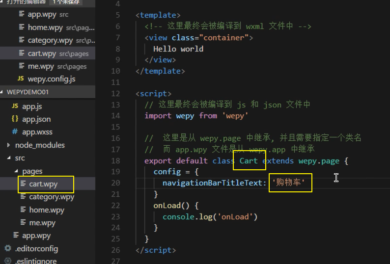

### WXML 模板

- WXML 充当的就是类似 HTML 的角色，是一种微信扩展的类 HTML 语言
- 不能使用 HTML 标签
- text 文本标签标签
  - selectable 属性是否允许长按选中
  - 在 text 文本标签中可以使用 `\n` 实现回车
- image
- navigator
  - 作用：导航链接，用来跳转页面用的，类似于 a 标签
  - url 属性可以用来配置导航的页面地址（该地址建议使用以 `/` 开头的绝对路径）
  - open-type 属性默认是 `navigate` 只能导航非 tab 页面
  - 如果需要导航 tab 标签页，则需要将 open-type 指定为 `switchTab`
  - 被导航的页面在左上角会带有一个返回的按钮（只有非标签页）
- view
  - 和 div 一样，用于布局的块容器
  - 在小程序中没有 ul、li、ol、p
  - 不需要考虑语义的问题，不需要考虑 SEO，因为它是小程序，不是在网页中打开的

### WXSS 样式

WXSS(WeiXin Style Sheets)是一套样式语言，用于描述 WXML 的组件样式。

WXSS 用来决定 WXML 的组件应该怎么显示。

为了适应广大的前端开发者，WXSS 具有 CSS 大部分特性。同时为了更适合开发微信小程序，WXSS 对 CSS 进行了扩充以及修改。

与 CSS 相比，WXSS 扩展的特性有：

- 尺寸单位
- 样式导入


### JS 逻辑交互


## 第二天

### 01-WXML公共样式

- 在小程序中图片一定要设置宽高
- flex 布局
- 图片的默认对齐方式
  - baseline
  - top
- 全局样式文件 app.wxss
  - 把公共的统一写到 app.wxss 全局样式中

### 02-wxss_布局响应式像素

- WXSS 对比 CSS 三点区别
  - 新增了尺寸单位 `rpx`
    - responsive 响应式尺寸，自动适配
  - 提供了全局样式和局部样式
    - 全局样式对所有页面都有效
    - 局部页面样式仅对当前页有效
  - WXSS 仅支持部分 CSS 选择器

### 03-wxss的选择器

- active 伪类

### 04-wxss的样式导入

使用`@import`语句可以导入外联样式表，`@import`后跟需要导入的外联样式表的相对路径，用`;`表示语句结束。

```css
/** common.wxss **/
.small-p {
  padding:5px;
}
```

```css
/** app.wxss **/
@import "common.wxss";
.middle-p {
  padding:15px;
}
```

### 05-小程序商城项目配置

- 新建项目
- 删除默认的页面
- 导入图片
- 配置顶部导航条
- 配置底部tabBar


### 06-搜索框布局

### 07-flex实现内容水平垂直居中

- 伸缩布局水平垂直居中
- flex 总结补充
  - [阮一峰 - Flex语法](http://www.ruanyifeng.com/blog/2015/07/flex-grammar.html)
  - [阮一峰 - Flex实例](http://www.ruanyifeng.com/blog/2015/07/flex-examples.html)

### 08-搜索框图标实现与注意事项

- 微信小程序不支持本地资源背景图


- 本地资源图片无法通过 WXSS 获取，可以使用 `网络图片`，或者 `base64`，或者使用 `<image/>` 标签。

### 09-swiper组件实现首页轮播图

> 参考链接：
>
> - [小程序开发文档 - 组件 - 视图容器 - swiper](https://developers.weixin.qq.com/miniprogram/dev/component/swiper.html)


### 10-轮播图属性配置

- 同上

### 11-首页导航点击状态修改


## 第三天（小程序的模板语法）

### 01-数据绑定

> 参考链接：
>
> - [小程序开发文档 - 框架 - 视图层 - WXML - 数据绑定](https://developers.weixin.qq.com/miniprogram/dev/framework/view/wxml/data.html)

- 小程序也是一个 MVVM 框架（也是数据驱动视图）
  - 学习小程序开发其实就是在学习小程序 MINA 框架
- 每个页面的数据定义在 Page 的 data 选项
- 数据绑定语法
  - `{{}}`
  - 属性：`<view title="{{ message }}"></view>`

### 02-列表渲染

> 参考链接：
>
> - [小程序开发文档 - 列表渲染](https://developers.weixin.qq.com/miniprogram/dev/framework/view/wxml/data.html)

### 03-列表渲染补充

> 参考链接：
>
> - [小程序开发文档 - 列表渲染](https://developers.weixin.qq.com/miniprogram/dev/framework/view/wxml/list.html)

- wx:key
- block
  - 类似于 Vue 中的 template，渲染结果不包含 block 元素

### 04-条件渲染

> 参考链接：
>
> - [小程序开发文档 - 条件渲染](https://developers.weixin.qq.com/miniprogram/dev/framework/view/wxml/conditional.html)

- wx:if 条件渲染
  - 如果条件为假，则该元素压根儿就不渲染
  - 它控制的是元素渲染与不渲染
- hidden 条件显示
  - 无论条件的真假，该元素始终都会渲染
  - 它控制的是元素的显示与不显示
- 这里和我们之前在  Vue 中学习的 v-if 和 v-show 道理是一样

### 05-事件基础

> 参考链接：
>
> - [小程序开发文档 - 事件处理](https://developers.weixin.qq.com/miniprogram/dev/framework/view/wxml/event.html)

### 06-事件补充

> 参考链接：
>
> - [小程序开发文档 - 事件处理](https://developers.weixin.qq.com/miniprogram/dev/framework/view/wxml/event.html)

- 事件绑定语法（冒泡）

```html
<view id="tapTest" data-hi="WeChat" bindtap="tapName"> Click me! </view>
```

```javascript
Page({
  tapName: function(event) {
    console.log(event)
  }
})
```


- 阻止冒泡的事件绑定

```html
<view id="tapTest" data-hi="WeChat" catchtap="tapName"> Click me! </view>
```


- 事件处理函数默认接收一个参数 event

```javascript
Page({
  tapName: function(event) { // 默认接收一个事件源对象
    console.log(event)
  }
})
```


- 事件传参

```html
<!-- 错误的写法，会把 bindViewTap(123) 整个当成函数名 -->
<!-- <view data-alpha-beta="1" data-alphaBeta="2" bindtap="bindViewTap(123)"> DataSet Test </view> -->

<view data-alpha-beta="1" data-alphaBeta="2" bindtap="bindViewTap"> DataSet Test </view>
```

```javascript
Page({
  bindViewTap:function(event){
    event.currentTarget.dataset.alphaBeta === 1 // - 会转为驼峰写法
    event.currentTarget.dataset.alphabeta === 2 // 大写会转为小写
  }
})
```


### 07-生命周期函数

> 参考链接：
>
> - [小程序开发文档 - 生命周期](https://developers.weixin.qq.com/miniprogram/dev/framework/app-service/app.html)

- 生命周期钩子函数
- 小程序的调试
- onLoad 生命周期函数可以获取当前页面的 query 参数

### 08-生命周期函数补充

> 参考链接：
>
> - [小程序开发文档 - 框架 - 视图层 - WXML - 数据绑定](https://developers.weixin.qq.com/miniprogram/dev/framework/view/wxml/data.html)

应用程序的生命周期：

- onLaunch
  - 小程序启动的时候来执行一次
- onShow
  - 小程序启动的时候或者从后台进入前台
- onHide
  - 小程序从前台进入后台
- onError
  - 小程序发生脚本错误
- onPageNotFound
  - 当小程序出现要打开的页面不存在的情况

页面的生命周期：

- onLoad
  - 页面第一次加载的时候
  - 发请求
  - 获取 query 参数
  - ...
- onShow
  - 从该页面看不见到看见的时候调用
- onReady
  - 页面初次渲染完成
- onHide
  - 从该页面看见到看不见的时候调用
- onUnload
  - 页面卸载的时候

### 09-小程序场景值

> 参考链接：
>
> - [小程序开发文档 - 框架 - 视图层 - WXML - 数据绑定](https://developers.weixin.qq.com/miniprogram/dev/framework/view/wxml/data.html)


### 10-本地服务器搭建（API Server 接口服务器）

- 新建一个数据库 `newshop`
- 将 `newshop.sql` 导入新建好的 `newshop` 数据库中
- 解压 `shop2-server.zip` 文件
- 通过终端进入 `shop2-server` 目录
- 然后在 `shop2-server` 目录下执行 `npm install` 命令安装项目的第三方依赖包
- 等待第三方包安装结束之后...
- 将 `shop2-server/config/default.json` 中的数据库连接信息修改为自己的
  + 数据库用户名、密码、端口号、连接的数据库名称
- 最后使用 `node app.js` 启动 API Server

如果看到如下输出，则说明安装成功：


`shop2-server` 目录下的 `微信小程序商城API文档.md` 就是我们的项目接口文档。


### 11-发起请求

- wx.request({请求配置参数})
- 小程序要求应用内部发出的请求都必须声明配置在请求名单中
  - 上线的时候，接口也是在线上，上线的小程序必须访问在线接口
    - 在线接口域名必须声明配置在小程序后台
  - 我们在开发的时候不需要配置也可以直接访问 localhost 本机，我们要做的就是在开发工具中关闭“不校验合法域名”


### 12-数据与视图更新

- `this.setData` 更新数据及视图，类似于 React 中的 `this.setState`
- 我们可以使用开发工具的调试器中自带的 "AppData" 选项栏来查看调试 data 响应式数据
  - 这个工具栏功能类似于我们之前在 Vue 中学习使用的 Vue DevTools
  - 还有 React 学习中使用的 React DevTools

## 第四天

### 01-小程序组件化框架选择

使用微信官方原生的小程序技术栈开发很麻烦，所以社区诞生了一些第三方小程序开发框架，引入了很多现在主流的开发特性，例如：

- 引入 npm 包
- Promise
- async function
- ...

开发完毕之后，这些框架都支持编译成小程序从而在微信中运行。


- [WePY](https://github.com/Tencent/wepy)
  - 腾讯官方
- [mpvue](https://github.com/Meituan-Dianping/mpvue)
  - 美团点评

### 02-项目环境安装

- WePY 微信交流群
- GitHub issue 查找提问问题

**全局安装或更新WePY命令行工具**

```bash
npm install wepy-cli -g
```

安装好 wepy 之后，我们可以通过 `wepy --help` 查看 wepy 的使用帮助：

```bash
C:\Users\lpz>wepy --help

  Usage: wepy <command> [options]

  Options:

    -v, --version                                  output the version number
    -h, --help                                     output usage information

  Commands:

    init [options] <template-name> [project-name]  generate a new project from a template
    build [options]                                build your project
    list [options]                                 list available official templates
    upgrade [options]                              upgrade to the latest version
    new                                            deprecated command, use "wepy init <template-name> <project-name>" instead
```

我们可以使用 `wepy --list` 查看可用的脚手架模板：

```bash
C:\Users\lpz>wepy list

  Available official templates:

     e.g., wepy init empty myproject

  +--------------------+------------------------------------------------------------+
  |        Name        |                        Description                         |
  +--------------------+------------------------------------------------------------+
  |       empty        |  空模板                                                    |
  +--------------------+------------------------------------------------------------+
  |      standard      |  模认模板，开启了promise、Async Function等                 |
  +--------------------+------------------------------------------------------------+

  Available github projects:

     e.g., wepy init wepyjs/wepy-wechat-demo myproject
...
...
...
```

接下来我们拉取指定模板进行初始化：

```bash
wepy init empty wepy-demo
```

### 03-代码风格配置

- eslint
- editorconfig

### 04-编辑器语法高亮

- [WePY - 代码高亮](https://tencent.github.io/wepy/document.html#/?id=%E4%BB%A3%E7%A0%81%E9%AB%98%E4%BA%AE)

### 05-编译项目


执行 `wepy build` 命令将 wepy 项目构建成小程序能识别的文件项目。


小程序无法直接运行 src 中的 wepy 源码，我们经过 `wepy build` 打包编译之后得到了一个 `dist` 结果目录。接下来我们就让小程序运行 `dist` 目录中的结果文件。 


- `.wpy` 文件
- 将 wepy 项目编译为小程序项目
  - 编译之前先执行 `npm install` 安装项目依赖的第三方包
  - `wepy build`
  - `wepy build --watch` 监视编译
- 构建结果存储在 `dist` 目录中

### 06-项目导入

- 使用微信小程序开发者工具打开 WePY 项目工程
- `project.config.json` 文件的 `miniprogramRoot` 属性可以配置小程序的根路径


### 07-项目全局设置

> 参考链接：
>
> - [.wpy文件说明](https://tencent.github.io/wepy/document.html#/?id=wpy%E6%96%87%E4%BB%B6%E8%AF%B4%E6%98%8E)
> - [小程序入口 app.apy](https://tencent.github.io/wepy/document.html#/?id=%E5%B0%8F%E7%A8%8B%E5%BA%8F%E5%85%A5%E5%8F%A3appwpy)
> - [页面 page.wpy](https://tencent.github.io/wepy/document.html#/?id=%E9%A1%B5%E9%9D%A2pagewpy)


页面：


一个`.wpy`文件可分为三大部分，各自对应于一个标签：

1. 脚本部分，即`<script></script>`标签中的内容，又可分为两个部分：

    逻辑部分，除了config对象之外的部分，对应于原生的`.js`文件；

    配置部分，即config对象，对应于原生的`.json`文件。

1. 结构部分，即`<template></template>`模板部分，对应于原生的`.wxml`文件。
2. 样式部分，即`<style></style>`样式部分，对应于原生的`.wxss`文件。

其中，小程序入口文件`app.wpy`不需要`template`，所以编译时会被忽略。`.wpy`文件中的`script`、`template`、`style`这三个标签都支持`lang`和`src`属性，`lang`决定了其代码编译过程，`src`决定是否外联代码，存在`src`属性且有效时，会忽略内联代码。

将原来项目的 `app.json` 文件中的配置项移入 WePY 项目中。


### 08-项目移植

page 页面文件结构：


- `app.wpy` 继承 `wepy.app`
- `页面.wpy` 继承 `wepy.page`

修改页面路径：


创建页面文件。


修改类名：



导入图片资源。

### 09-新建文件补充

### 10-请求数据

> 参考链接：
>
> - [开发模式转换](https://tencent.github.io/wepy/document.html#/?id=%E5%BC%80%E5%8F%91%E6%A8%A1%E5%BC%8F%E8%BD%AC%E6%8D%A2)

- 接口服务
- `wx.request`
- 更新视图数据，直接修改，不再需要使用 `this.setData` 了

WePY框架在开发过程中参考了Vue等现有框架的一些语法风格和功能特性，对原生小程序的开发模式进行了再次封装，更贴近于MVVM架构模式。以下是使用WePY前后的代码对比。

原生代码：

```javascript
//index.js

//获取应用实例
var app = getApp()

//通过Page构造函数创建页面逻辑
Page({
    //可用于页面模板绑定的数据
    data: {
        motto: 'Hello World',
        userInfo: {}
    },

    //事件处理函数
    bindViewTap: function() {
        console.log('button clicked')
    },

    //页面的生命周期函数
    onLoad: function () {
        console.log('onLoad')
    }
})
```

基于WePY的代码：

- data 初始化
- methods 选项

```javascript
//index.wpy中的<script>部分

import wepy from 'wepy';

//通过继承自wepy.page的类创建页面逻辑
export default class Index extends wepy.page {
    //可用于页面模板绑定的数据
    data = {
        motto: 'Hello World',
        userInfo: {}
    };

    //事件处理函数(集中保存在methods对象中)
    methods = {
        bindViewTap () {
            console.log('button clicked');
        }
    };

    //页面的生命周期函数
    onLoad() {
        console.log('onLoad');
    };
}
```


### 11-wepy对象

> 参考链接：
>
> - [针对原生 API 进行优化](https://tencent.github.io/wepy/document.html#/?id=%E9%92%88%E5%AF%B9%E5%8E%9F%E7%94%9Fapi%E8%BF%9B%E8%A1%8C%E4%BC%98%E5%8C%96)

- wepy 封装了 wx，保留原有 API 功能不变的情况下针对原有 API 进行了优化，例如 Promise 处理。

对小程序原生API进行promise处理，同时修复了一些原生API的缺陷，比如：wx.request的并发问题等。

原生代码：

```javascript
onLoad = function () {
    var self = this;
    wx.login({
        success: function (data) {
            wx.getUserInfo({
                success: function (userinfo) {
                    self.setData({userInfo: userinfo});
                }
            });
        }
    });
}
```

基于WePY的代码：

```javascript
import wepy from 'wepy';

async onLoad() {
    await wepy.login();
    this.userInfo = await wepy.getUserInfo();
}
```


### 12-$apply异步数据脏检查

> 参考链接：
>
> - [WePY 数据绑定方式](https://tencent.github.io/wepy/document.html#/?id=%E6%95%B0%E6%8D%AE%E7%BB%91%E5%AE%9A)

WePY使用脏数据检查对setData进行封装，在函数运行周期结束时执行脏数据检查，一来可以不用关心页面多次setData是否会有性能上的问题，二来可以更加简洁去修改数据实现绑定，不用重复去写setData方法。代码如下：

```javascript
this.title = 'this is title';
```

需注意的是，在异步函数中更新数据的时候，必须手动调用`$apply`方法，才会触发脏数据检查流程的运行。如：

```javascript
setTimeout(() => {
  this.title = 'this is title';
  this.$apply();
}, 3000);
```


## 第五天

### 01-API代码提示插件

- Visual Studio Code 编辑器的 WePY 代码提示
  - wepy snippets


### 02-安装并配置Promise

> 参考链接：
>
> - [wepy项目中使用Promise](https://github.com/Tencent/wepy/wiki/wepy%E9%A1%B9%E7%9B%AE%E4%B8%AD%E4%BD%BF%E7%94%A8Promise)
> - [wepy项目中使用async await](https://github.com/Tencent/wepy/wiki/wepy%E9%A1%B9%E7%9B%AE%E4%B8%AD%E4%BD%BF%E7%94%A8async-await)
>   - 如果配置了 async 支持，则也开启了 Promise 支持

### 03-Promise写法

### 04-请求封装


### 05-API分治管理


### 06-分治后api调用

先导出：


在加载使用：


### 07-首页导航完成

- 请求数据
- 更新数据
- 模板视图绑定

### 08-组件分治

> [WePy 组件](https://tencent.github.io/wepy/document.html#/?id=%E7%BB%84%E4%BB%B6)

### 09-首页楼层分治

- 拆分首页底部导航楼层组件
- 发请求，更新视图
- 模板语法遍历


### 10-首页楼层完成

### 11-返回顶部组件书写

### 12-事件与返回顶部

### 13-字体图标应用

- 导入字体图标
  - 微信不支持本地资源
- 底线区域布局

## WePY

- [GitHub仓库](https://github.com/Tencent/wepy)
- [官网](https://tencent.github.io/wepy/)
- [官方文档](https://tencent.github.io/wepy/document.html)
- [Awesome wepy](https://github.com/aben1188/awesome-wepy)
- [更新日志](https://tencent.github.io/wepy/document.html#/changelog)

特性：

- 类Vue开发风格
- 支持自定义组件开发
- 支持引入NPM包
- 支持[Promise](https://github.com/wepyjs/wepy/wiki/wepy%E9%A1%B9%E7%9B%AE%E4%B8%AD%E4%BD%BF%E7%94%A8Promise)
- 支持ES2015+特性，如[Async Functions](https://github.com/wepyjs/wepy/wiki/wepy%E9%A1%B9%E7%9B%AE%E4%B8%AD%E4%BD%BF%E7%94%A8async-await)
- 支持多种编译器，Less/Sass/Stylus/PostCSS、Babel/Typescript、Pug
- 支持多种插件处理，文件压缩，图片压缩，内容替换等
- 支持 Sourcemap，ESLint等
- 小程序细节优化，如请求列队，事件优化等
