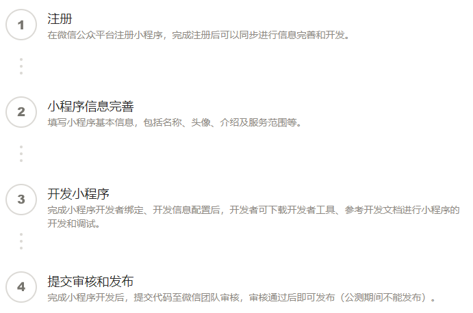

# 第2章 开发前准备

> 参考链接：
>
> - [https://developers.weixin.qq.com/miniprogram/dev/quickstart/basic/getting-started.html](https://developers.weixin.qq.com/miniprogram/dev/quickstart/basic/getting-started.html)

## 小程序接入流程

## 开发支持

- 设计指南
- 开发文档
- 开发者工具
- 小程序体验 DEMO

## 申请账号获取 AppID

## 安装开发工具

## 第一个小程序

## 编译和预览体验

