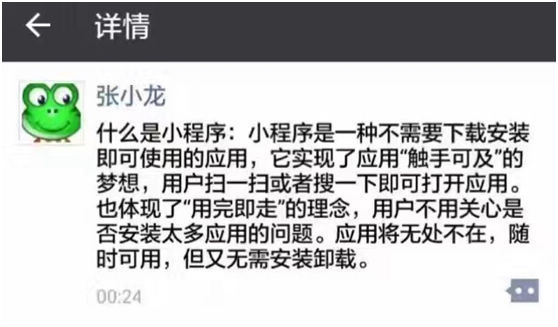
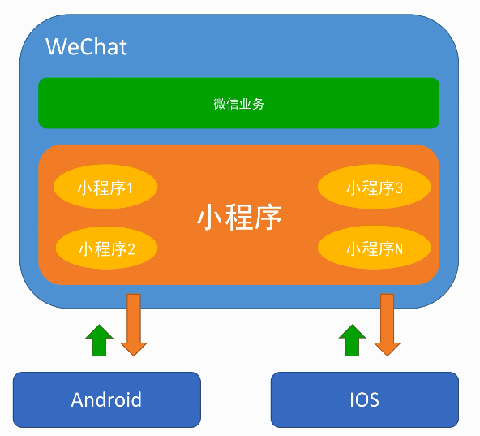
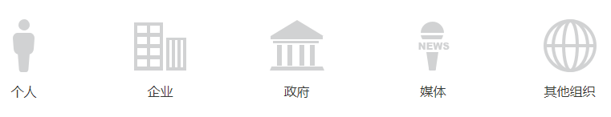
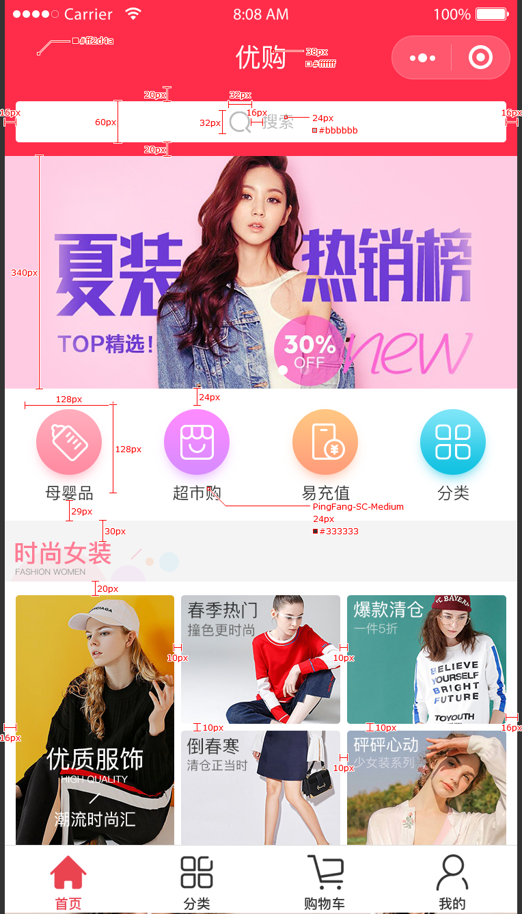

# 第1章 小程序介绍

## 体验微信小程序

- 拼多多
- 今日头条
- 摩拜单车
- 滴滴出行
- 智行火车票
- 小米商城Lite
- 今日头条
- 腾讯视频
- 美团外卖
- ...

## 是什么

微信小程序，简称小程序，英文名 `Mini Program`，是一种不需要下载安装即可使用的应用，它实现了应用“触手可及”的梦想，用户扫一扫或者搜一下即可打开应用。也体现了“用完即走”的理念，用户不用关心是否安装太多应用的问题。应用将无处不在，随时可用，但又无需安装卸载。对于开发者而言，小程序开发门槛相对较低，难度不及APP，能够满足简单的基础应用，适合生活服务类线下商铺以及非刚需低频应用的转换。

## 发展历史

- 2016年1月11日，微信之父张小龙公布微信小程序
- 2016年9月21日，微信小程序正式开启内测
- 2017年1月9日，第一批小程序正式上线
- 2017年12月28日，微信更新的 6.6.1 版开放了小游戏，微信启动页面推荐了小游戏《跳一跳》，可以通过小程序找到已经玩到小游戏
- 2018年1月25日，微信团队在“微信公众平台”发布公告称，“从移动应用分享至微信的小程序页面，用户访问时支持打开来源应用。

## 小程序的运行平台

## 谁可以注册开发小程序

## 项目演示

## 技术栈

- 微信小程序
- WePY
- Flex
- ECMAScript 6
- 模块化和组件化
- 小程序登陆
- 用户中心
- 商品搜索
- 商品展示
- 购物车

## 相关链接

- [百度百科 - 微信小程序](https://baike.baidu.com/item/%E5%BE%AE%E4%BF%A1%E5%B0%8F%E7%A8%8B%E5%BA%8F)
- [知乎 - 如何入门微信小程序开发，有哪些学习资料？](https://www.zhihu.com/question/50907897)
- [GitHub - 微信小程序开发资源汇总](https://github.com/justjavac/awesome-wechat-weapp)
- [小程序官网](https://mp.weixin.qq.com/cgi-bin/wx)
