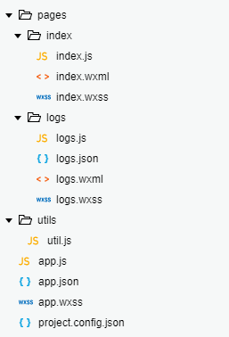

# 第3章 小程序的文件结构及配置

在上一章中，我们通过开发者工具快速创建了一个 QuickStart 项目。你可以留意到这个项目里边生成了不同类型的文件:

1. .json 后缀的 JSON 配置文件
2. .wxml 后缀的 WXML 模板文件
3. .wxss 后缀的 WXSS 样式文件
4. .js 后缀的 JS 脚本逻辑文件

接下来我们分别看看这4种文件的作用。




## 文件结构

小程序包含一个描述整体程序的 app 和多个描述各自页面的 page。

一个小程序主体部分由三个文件组成，必须放在项目的根目录，如下：

| 文件                                                         | 必填 | 作用             |
| ------------------------------------------------------------ | ---- | ---------------- |
| [app.js](https://developers.weixin.qq.com/miniprogram/dev/framework/app-service/app.html) | 是   | 小程序逻辑       |
| [app.json](https://developers.weixin.qq.com/miniprogram/dev/framework/config.html) | 是   | 小程序公共设置   |
| [app.wxss](https://developers.weixin.qq.com/miniprogram/dev/framework/view/wxss.html) | 否   | 小程序公共样式表 |

一个小程序页面由四个文件组成，分别是：

| 文件类型                                                     | 必填 | 作用       |
| ------------------------------------------------------------ | ---- | ---------- |
| [js](https://developers.weixin.qq.com/miniprogram/dev/framework/app-service/page.html) | 是   | 页面逻辑   |
| [wxml](https://developers.weixin.qq.com/miniprogram/dev/framework/view/wxml/) | 是   | 页面结构   |
| [wxss](https://developers.weixin.qq.com/miniprogram/dev/framework/view/wxss.html) | 否   | 页面样式表 |
| [json](https://developers.weixin.qq.com/miniprogram/dev/framework/config.html#pagejson) | 否   | 页面配置   |

**注意：为了方便开发者减少配置项，描述页面的四个文件必须具有相同的路径与文件名。**

## 小程序配置 app.json

`app.json` 文件用来对微信小程序进行全局配置，决定页面文件的路径、窗口表现、设置网络超时时间、设置多 tab 等。

以下是一个包含了所有配置选项的 `app.json` ：

```json
{
  "pages": [
    "pages/index/index",
    "pages/logs/index"
  ],
  "window": {
    "navigationBarTitleText": "Demo"
  },
  "tabBar": {
    "list": [{
      "pagePath": "pages/index/index",
      "text": "首页"
    }, {
      "pagePath": "pages/logs/logs",
      "text": "日志"
    }]
  },
  "networkTimeout": {
    "request": 10000,
    "downloadFile": 10000
  },
  "debug": true
}
```

`app.json` 配置项列表：

| 属性                                                         | 类型         | 必填 | 描述                    |
| ------------------------------------------------------------ | ------------ | ---- | ----------------------- |
| [pages](https://developers.weixin.qq.com/miniprogram/dev/framework/config.html#pages) | String Array | 是   | 设置页面路径            |
| [window](https://developers.weixin.qq.com/miniprogram/dev/framework/config.html#window) | Object       | 否   | 设置默认页面的窗口表现  |
| [tabBar](https://developers.weixin.qq.com/miniprogram/dev/framework/config.html#tabbar) | Object       | 否   | 设置底部 tab 的表现     |
| [networkTimeout](https://developers.weixin.qq.com/miniprogram/dev/framework/config.html#networktimeout) | Object       | 否   | 设置网络超时时间        |
| [debug](https://developers.weixin.qq.com/miniprogram/dev/framework/config.html#debug) | Boolean      | 否   | 设置是否开启 debug 模式 |

### pages

接受一个数组，每一项都是字符串，来指定小程序由哪些页面组成。每一项代表对应页面的【路径+文件名】信息，**数组的第一项代表小程序的初始页面。小程序中新增/减少页面，都需要对 pages 数组进行修改。**

文件名不需要写文件后缀，因为框架会自动去寻找路径下 `.json`, `.js`, `.wxml`, `.wxss` 四个文件进行整合。

如开发目录为：

> pages/
>
> pages/index/index.wxml
>
> pages/index/index.js
>
> pages/index/index.wxss
>
> pages/logs/logs.wxml
>
> pages/logs/logs.js
>
> app.js
>
> app.json
>
> app.wxss

则需要在 app.json 中写

```json
{
  "pages":[
    "pages/index/index",
    "pages/logs/logs"
  ]
}
```

### window

用于设置小程序的状态栏、导航条、标题、窗口背景色。

| 属性                         | 类型     | 默认值  | 描述                                                         | 最低版本        |
| ---------------------------- | -------- | ------- | ------------------------------------------------------------ | --------------- |
| navigationBarBackgroundColor | HexColor | #000000 | 导航栏背景颜色，如"#000000"                                  |                 |
| navigationBarTextStyle       | String   | white   | 导航栏标题颜色，仅支持 black/white                           |                 |
| navigationBarTitleText       | String   |         | 导航栏标题文字内容                                           |                 |
| navigationStyle              | String   | default | 导航栏样式，仅支持 default/custom。custom 模式可自定义导航栏，只保留右上角胶囊状的按钮 | 微信版本 6.6.0  |
| backgroundColor              | HexColor | #ffffff | 窗口的背景色                                                 |                 |
| backgroundTextStyle          | String   | dark    | 下拉 loading 的样式，仅支持 dark/light                       |                 |
| backgroundColorTop           | String   | #ffffff | 顶部窗口的背景色，仅 iOS 支持                                | 微信版本 6.5.16 |
| backgroundColorBottom        | String   | #ffffff | 底部窗口的背景色，仅 iOS 支持                                | 微信版本 6.5.16 |
| enablePullDownRefresh        | Boolean  | false   | 是否开启下拉刷新，详见[页面相关事件处理函数](https://developers.weixin.qq.com/miniprogram/dev/framework/app-service/page.html#%E9%A1%B5%E9%9D%A2%E7%9B%B8%E5%85%B3%E4%BA%8B%E4%BB%B6%E5%A4%84%E7%90%86%E5%87%BD%E6%95%B0) |                 |
| onReachBottomDistance        | Number   | 50      | 页面上拉触底事件触发时距页面底部距离，单位为px               |                 |

**注：HexColor（十六进制颜色值），如"#ff00ff"**

**注：navigationStyle 只在 app.json 中生效。开启 custom 后，低版本客户端需要做好兼容。开发者工具基础库版本切到 1.7.0（不代表最低版本，只供调试用） 可方便切到旧视觉**

如 app.json ：

```json
{
  "window":{
    "navigationBarBackgroundColor": "#ffffff",
    "navigationBarTextStyle": "black",
    "navigationBarTitleText": "微信接口功能演示",
    "backgroundColor": "#eeeeee",
    "backgroundTextStyle": "light"
  }
}
```


### tabBar

如果小程序是一个多 tab 应用（客户端窗口的底部或顶部有 tab 栏可以切换页面），可以通过 tabBar 配置项指定 tab 栏的表现，以及 tab 切换时显示的对应页面。

**Tip：**

1. 当设置 position 为 top 时，将不会显示 icon
2. tabBar 中的 list 是一个数组，**只能配置最少2个、最多5个 tab**，tab 按数组的顺序排序。

**属性说明：**

| 属性            | 类型     | 必填 | 默认值 | 描述                                                 |
| --------------- | -------- | ---- | ------ | ---------------------------------------------------- |
| color           | HexColor | 是   |        | tab 上的文字默认颜色                                 |
| selectedColor   | HexColor | 是   |        | tab 上的文字选中时的颜色                             |
| backgroundColor | HexColor | 是   |        | tab 的背景色                                         |
| borderStyle     | String   | 否   | black  | tabbar上边框的颜色， 仅支持 black/white              |
| list            | Array    | 是   |        | tab 的列表，详见 list 属性说明，最少2个、最多5个 tab |
| position        | String   | 否   | bottom | 可选值 bottom、top                                   |

其中 list 接受一个数组，数组中的每个项都是一个对象，其属性值如下：

| 属性             | 类型   | 必填 | 说明                                                         |
| ---------------- | ------ | ---- | ------------------------------------------------------------ |
| pagePath         | String | 是   | 页面路径，必须在 pages 中先定义                              |
| text             | String | 是   | tab 上按钮文字                                               |
| iconPath         | String | 否   | 图片路径，icon 大小限制为40kb，建议尺寸为 81px * 81px，当 postion 为 top 时，此参数无效，不支持网络图片 |
| selectedIconPath | String | 否   | 选中时的图片路径，icon 大小限制为40kb，建议尺寸为 81px * 81px ，当 postion 为 top 时，此参数无效 |

 


### networkTimeout

可以设置各种网络请求的超时时间。

**属性说明：**

| 属性          | 类型   | 必填 | 说明                                                         |
| ------------- | ------ | ---- | ------------------------------------------------------------ |
| request       | Number | 否   | [wx.request](https://developers.weixin.qq.com/miniprogram/dev/api/network-request.html)的超时时间，单位毫秒，默认为：60000 |
| connectSocket | Number | 否   | [wx.connectSocket](https://developers.weixin.qq.com/miniprogram/dev/api/network-socket.html)的超时时间，单位毫秒，默认为：60000 |
| uploadFile    | Number | 否   | [wx.uploadFile](https://developers.weixin.qq.com/miniprogram/dev/api/network-file.html#wxuploadfileobject)的超时时间，单位毫秒，默认为：60000 |
| downloadFile  | Number | 否   | [wx.downloadFile](https://developers.weixin.qq.com/miniprogram/dev/api/network-file.html#wxdownloadfileobject)的超时时间，单位毫秒，默认为：60000 |

### debug

可以在开发者工具中开启 debug 模式，在开发者工具的控制台面板，调试信息以 info 的形式给出，其信息有`Page的注册`，`页面路由`，`数据更新`，`事件触发` 。 可以帮助开发者快速定位一些常见的问题。 

## 页面配置 page.json

每一个小程序页面也可以使用 `.json` 文件来对本页面的窗口表现进行配置。 页面的配置比`app.json`全局配置简单得多，只是设置 app.json 中的 window 配置项的内容，页面中配置项会覆盖 app.json 的 window 中相同的配置项。

页面的 `.json` 只能设置 `window` 相关的配置项，以决定本页面的窗口表现，所以无需写 `window` 这个键，如：

| 属性                         | 类型     | 默认值  | 描述                                                         |      |
| ---------------------------- | -------- | ------- | ------------------------------------------------------------ | ---- |
| navigationBarBackgroundColor | HexColor | #000000 | 导航栏背景颜色，如"#000000"                                  |      |
| navigationBarTextStyle       | String   | white   | 导航栏标题颜色，仅支持 black/white                           |      |
| navigationBarTitleText       | String   |         | 导航栏标题文字内容                                           |      |
| backgroundColor              | HexColor | #ffffff | 窗口的背景色                                                 |      |
| backgroundTextStyle          | String   | dark    | 下拉 loading 的样式，仅支持 dark/light                       |      |
| enablePullDownRefresh        | Boolean  | false   | 是否开启下拉刷新，详见[页面相关事件处理函数](https://developers.weixin.qq.com/miniprogram/dev/framework/app-service/page.html#%E9%A1%B5%E9%9D%A2%E7%9B%B8%E5%85%B3%E4%BA%8B%E4%BB%B6%E5%A4%84%E7%90%86%E5%87%BD%E6%95%B0)。 |      |
| disableScroll                | Boolean  | false   | 设置为 true 则页面整体不能上下滚动；只在 page.json 中有效，无法在 app.json 中设置该项 |      |
| onReachBottomDistance        | Number   | 50      | 页面上拉触底事件触发时距页面底部距离，单位为px               |      |

```json
{
  "navigationBarBackgroundColor": "#ffffff",
  "navigationBarTextStyle": "black",
  "navigationBarTitleText": "微信接口功能演示",
  "backgroundColor": "#eeeeee",
  "backgroundTextStyle": "light"
}
```

## 工具配置 project.config.json

通常大家在使用一个工具的时候，都会针对各自喜好做一些个性化配置，例如界面颜色、编译配置等等，当你换了另外一台电脑重新安装工具的时候，你还要重新配置。

考虑到这点，小程序开发者工具在每个项目的根目录都会生成一个 project.config.json，你在工具上做的任何配置都会写入到这个文件，当你重新安装工具或者换电脑工作时，你只要载入同一个项目的代码包，开发者工具就自动会帮你恢复到当时你开发项目时的个性化配置，其中会包括编辑器的颜色、代码上传时自动压缩等等一系列选项。

其他配置项细节可以参考文档 [开发者工具的配置](https://developers.weixin.qq.com/miniprogram/dev/devtools/edit.html#%E9%A1%B9%E7%9B%AE%E9%85%8D%E7%BD%AE%E6%96%87%E4%BB%B6) 。

## Q&A

- app.json 文件是干嘛的？
  - 小程序全局配置文件
- app.json 文件中的 pages 是用来配置什么的
  - 用来配置小程序页面，也就是说小程序中出现的所有页面都必须配置在 pages 选项中
- 小程序如何添加页面？
  - 只需要在 pages 中增加一个页面路径即可
- 配置规则？
  - 字符串数组
  - 字符串存储一个以 `pages/` 开头的路径
- app.json 文件中的 window 选项可以做什么？
  - 用于设置小程序的状态栏、导航条、标题、窗口背景色。
- 除了 app.json 全局配置文件之外，每个页面都有一个可选的 json 配置文件
- 页面自己的 JSON 文件只能用来配置当前页面的 Window 窗口效果
  - 页面自己的 Window 会覆盖掉 app.json 的 Window 配置
