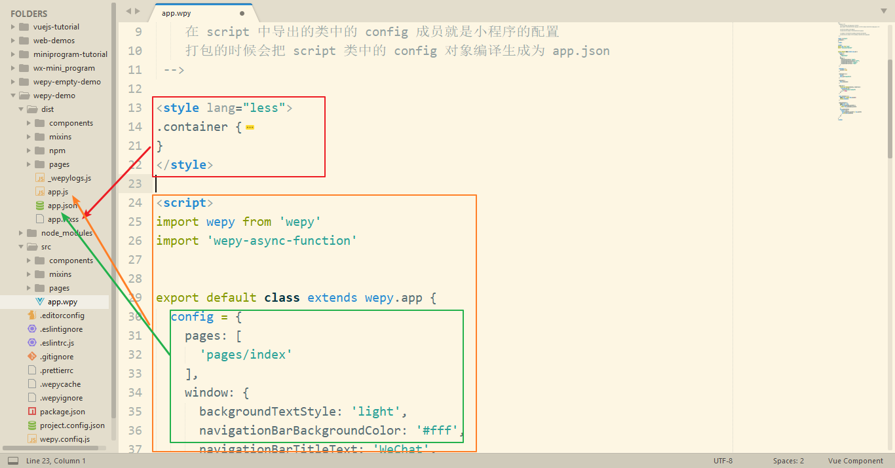

# Wepy

## 介绍

### 是什么

WePY (发音: /'wepi/)是一款让小程序支持组件化开发的框架，通过预编译的手段让开发者可以选择自己喜欢的开发风格去开发小程序。框架的细节优化，Promise，Async Functions的引入都是为了能让开发小程序项目变得更加简单，高效。

同时WePY也是一款成长中的框架，大量吸收借鉴了一些优化前端工具以及框架的设计理念和思想。如果WePY有不足地方，或者你有更好的想法，欢迎提交ISSUE或者PR。

### 特性

- 类Vue开发风格
- 支持自定义组件开发
- 支持引入NPM包
- 支持Promise
- 支持ES2015+特性，如Async Functions
- 支持多种编译器，Less/Sass/Stylus/PostCSS、Babel/Typescript、Pug
- 支持多种插件处理，文件压缩，图片压缩，内容替换等
- 支持 Sourcemap，ESLint等
- 小程序细节优化，如请求列队，事件优化等

### 相关链接

- [Wepy 官方文档](https://tencent.github.io/wepy/)
- [Wepy GitHub](https://github.com/Tencent/wepy)

## Hello World

```bash
# 全局安装 Wepy 命令行工具
npm i -g wepy-cli

# 查看安装的 Wepy 确实 Wepy 是否安装好
wepy --version

# 查看可用模板
wepy list

# 使用 Wepy 基于 standard 模板初始化项目
wepy init standard wepy-demo

# 安装依赖
cd wepy-demo
npm install

# 执行打包
# wepy 会把 src 中的源码编程成小程序代码文件，输出到 dist 目录中
wepy build

# 监视打包
# 建议在开发的时候使用监视代码，Wepy 会监视 src 源码的改变，然后实时的编译打包
wepy build -w
```

为了方便学习，这里我们重新初始化一个 `empty` 简单模板。

```bash
wepy init empty wepy-empty-demo
cd wepy-empty-demo
npm install
wepy build -w
```

## app.wpy



## 页面.wpy


