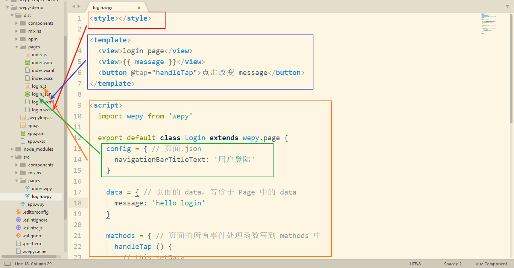

# WePY

## 介绍

### 是什么

WePY (发音: /'wepi/)是一款让小程序支持组件化开发的框架，通过预编译的手段让开发者可以选择自己喜欢的开发风格去开发小程序。框架的细节优化，Promise，Async Functions的引入都是为了能让开发小程序项目变得更加简单，高效。

同时WePY也是一款成长中的框架，大量吸收借鉴了一些优化前端工具以及框架的设计理念和思想。如果WePY有不足地方，或者你有更好的想法，欢迎提交ISSUE或者PR。

### 特性

- 类Vue开发风格
- 支持自定义组件开发
- 支持引入NPM包
- 支持Promise
- 支持ES2015+特性，如Async Functions
- 支持多种编译器，Less/Sass/Stylus/PostCSS、Babel/Typescript、Pug
- 支持多种插件处理，文件压缩，图片压缩，内容替换等
- 支持 Sourcemap，ESLint等
- 小程序细节优化，如请求列队，事件优化等

### 相关链接

- [Wepy 官方文档](https://tencent.github.io/wepy/)
- [Wepy GitHub](https://github.com/Tencent/wepy)

## 快速入门

### 安装

```bash
# 全局安装 Wepy 命令行工具
npm i -g wepy-cli

# 查看安装的 Wepy 确实 Wepy 是否安装好
wepy --version
```


### 初始化

```bash
# 查看可用模板
wepy list
```

```bash
# 使用 Wepy 基于 standard 模板初始化项目
wepy init standard wepy-demo
```

```bash
# 安装依赖
cd wepy-demo
npm install
```


### 编译构建

```bash
# 执行打包
# wepy 会把 src 中的源码编程成小程序代码文件，输出到 dist 目录中
wepy build

# 监视打包
# 建议在开发的时候使用监视代码，Wepy 会监视 src 源码的改变，然后实时的编译打包
wepy build -w
```

### 项目目录结构

```
├── dist                   小程序运行代码目录（该目录由WePY的build指令自动编译生成，请不要直接修改该目录下的文件）
├── node_modules           
├── src                    代码编写的目录（该目录为使用WePY后的开发目录）
|   ├── components         WePY组件目录（组件不属于完整页面，仅供完整页面或其他组件引用）
|   |   ├── com_a.wpy      可复用的WePY组件a
|   |   └── com_b.wpy      可复用的WePY组件b
|   ├── pages              WePY页面目录（属于完整页面）
|   |   ├── index.wpy      index页面（经build后，会在dist目录下的pages目录生成index.js、index.json、index.wxml和index.wxss文件）
|   |   └── other.wpy      other页面（经build后，会在dist目录下的pages目录生成other.js、other.json、other.wxml和other.wxss文件）
|   └── app.wpy            小程序配置项（全局数据、样式、声明钩子等；经build后，会在dist目录下生成app.js、app.json和app.wxss文件）
└── package.json           项目的package配置
```

#### app.wpy


#### 页面.wpy




### 添加项目

`1.7.0` 之后的版本`init`新生成的代码包会在根目录包含`project.config.json`文件，之前生成的代码包可能不存在`project.config.json`文件。 检查根目录是否存在该文件。

如果存在，使用`微信开发者工具`-->`添加项目`，`项目目录`请选择项目根目录即可根据配置完成项目信息自动配置。

如果不存在，建议手动创建该文件后再添加项目。`project.config.json`文件内容如下：

```json
{
  "description": "project description",
  "setting": {
    "urlCheck": true,
    "es6": false,
    "postcss": false,
    "minified": false
  },
  "compileType": "miniprogram",
  "appid": "touristappid",
  "projectname": "Project name",
  "miniprogramRoot": "./dist"
}
```

`es6`: 对应`关闭ES6转ES5`选项，关闭。 重要：未关闭会运行报错。

`postcss`: 对应`关闭上传代码时样式自动补全`选项，关闭。 重要：某些情况下漏掉此项也会运行报错。

`minified`: 对应`关闭代码压缩上传`选项，关闭。重要：开启后，会导致真机computed, props.sync 等等属性失效。（注：压缩功能可使用WePY提供的build指令代替，详见后文相关介绍以及Demo项目根目录中的`wepy.config.js`和`package.json`文件。）

`urlCheck`: 对应`不检查安全域名`选项，开启。 如果已配置好安全域名则建议关闭。

### 参考建议

1. WePY借鉴了Vue.js（后文简称Vue）的语法风格和功能特性，如果你之前从未接触过Vue，建议先阅读Vue的官方文档，以熟悉相关概念，否则在阅读WePY文档以及使用WePY进行开发的过程中，将会遇到比较多的障碍。

2. 开发建议使用第三方成熟IDE或编辑器(具体请参看后文的代码高亮部分)，微信开发者工具仅用于实时预览和调试。

### 代码高亮

文件后缀为`.wpy`，可共用`Vue`的高亮规则，但需要手动设置。下面提供一些常见IDE或编辑器中实现代码高亮的相关设置步骤以供参考(也可通过更改文件后缀名的方式来实现高亮，详见后文相关介绍)。

- **Sublime**

  1. 打开`Sublime->Preferences->Browse Packages..`进入用户包文件夹。

  2. 在此文件夹下打开cmd，运行`git clone git@github.com:vuejs/vue-syntax-highlight.git`，无GIT用户可以直接下载[zip包](https://github.com/vuejs/vue-syntax-highlight/archive/master.zip)解压至当前文件夹。

  3. 关闭`.wpy`文件重新打开即可高亮。

- **WebStorm/PhpStorm**

  1. 打开`Settings`，搜索`Plugins`，搜索`Vue.js`插件并安装。

  2. 打开`Settings`，搜索`File Types`，找到`Vue.js Template`，在`Registered Patterns`添加`*.wpy`，即可高亮。

- **Atom**

  1. 在Atom里先安装Vue的语法高亮 - `language-vue`，如果装过了就忽略这一步。

  2. 打开`Atom -> Config`菜单。在`core`键下添加：

```javascript
customFileTypes:
   "text.html.vue": [
      "wpy"
   ]
```

- **VS Code**

  1. 在 Code 里先安装 Vue 的语法高亮插件 `Vetur`。

  2. 打开任意 `.wpy` 文件。

  3. 点击右下角的选择语言模式，默认为`纯文本`。

  4. 在弹出的窗口中选择 `.wpy 的配置文件关联...`。

  5. 在`选择要与 .wpy 关联的语言模式` 中选择 `Vue`。

- **VIM**

  1. 安装 `Vue` 的 VIM 高亮插件，例如 [posva/vim-vue](https://github.com/posva/vim-vue)。

  2. 配置 `.wpy` 后缀名的文件使用 `Vue` 语法高亮。

```
 au BufRead,BufNewFile *.wpy setlocal filetype=vue.html.javascript.css
```

### 代码编写规则

1. 变量与方法尽量使用驼峰式命名，并且注意避免使用`$`开头。 以`$`开头的标识符为WePY框架的内建属性和方法，可在JavaScript脚本中以`this.`的方式直接使用，具体请[参考API文档](https://tencent.github.io/wepy/document.html#/api?id=api)。
2. 小程序入口、页面、组件文件名的后缀为`.wpy`；外链的文件可以是其它后缀。 具体请参考[wpy文件说明](https://tencent.github.io/wepy/document.html#/?id=wpy%e6%96%87%e4%bb%b6%e8%af%b4%e6%98%8e)。
3. 使用ES6语法开发。 框架在ES6(ECMAScript 6)下开发，因此也需要使用ES6开发小程序，ES6中有大量的语法糖可以让我们的代码更加简洁高效。
4. 使用Promise。 框架默认对小程序提供的API全都进行了 Promise 处理，甚至可以直接使用`async/await`等新特性进行开发。[启用Promise方法](https://github.com/Tencent/wepy/wiki/wepy%E9%A1%B9%E7%9B%AE%E4%B8%AD%E4%BD%BF%E7%94%A8Promise)
5. 事件绑定语法使用优化语法代替。
   - 原 `bindtap="click"` 替换为 `@tap="click"`，原`catchtap="click"`替换为`@tap.stop="click"`。
   - 原 `capture-bind:tap="click"` 替换为 `@tap.capture="click"`，原`capture-catch:tap="click"`替换为`@tap.capture.stop="click"`。
   - 更多`@`符用法，参见[组件自定义事件](https://tencent.github.io/wepy/document.html#/?id=%E7%BB%84%E4%BB%B6%E8%87%AA%E5%AE%9A%E4%B9%89%E4%BA%8B%E4%BB%B6%E5%A4%84%E7%90%86%E5%87%BD%E6%95%B0)。
6. 事件传参使用优化后语法代替。 原`bindtap="click" data-index={{index}}`替换为`@tap="click({{index}})"`。
7. 自定义组件命名应避开微信原生组件名称以及功能标签`<repeat>`。 不可以使用`input、button、view、repeat`等微信小程序原生组件名称命名自定义组件；另外也不要使用WePY框架定义的辅助标签`repeat`命名。有关`repeat`的详细信息，请参见[循环列表组件引用](https://tencent.github.io/wepy/document.html#/?id=%E7%BB%84%E4%BB%B6%E7%9A%84%E5%BE%AA%E7%8E%AF%E6%B8%B2%E6%9F%93)。

## 主要功能特性


### 开发模式转换

WePY框架在开发过程中参考了Vue等现有框架的一些语法风格和功能特性，对原生小程序的开发模式进行了再次封装，更贴近于MVVM架构模式。以下是使用WePY前后的代码对比。

原生代码：

```javascript
//index.js

//获取应用实例
var app = getApp()

//通过Page构造函数创建页面逻辑
Page({
    //可用于页面模板绑定的数据
    data: {
        motto: 'Hello World',
        userInfo: {}
    },

    //事件处理函数
    bindViewTap: function() {
        console.log('button clicked')
    },

    //页面的生命周期函数
    onLoad: function () {
        console.log('onLoad')
    }
})
```

基于WePY的代码：

```javascript
//index.wpy中的<script>部分

import wepy from 'wepy';

//通过继承自wepy.page的类创建页面逻辑
export default class Index extends wepy.page {
    //可用于页面模板绑定的数据
    data = {
        motto: 'Hello World',
        userInfo: {}
    };

    //事件处理函数(集中保存在methods对象中)
    methods = {
        bindViewTap () {
            console.log('button clicked');
        }
    };

    //页面的生命周期函数
    onLoad() {
        console.log('onLoad');
    };
}
```

### 支持组件化开发

参见章节：[组件](https://tencent.github.io/wepy/document.html#/?id=%e7%bb%84%e4%bb%b6)

示例代码：

```vue
// index.wpy

<template>
    <view>
        <panel>
            <h1 slot="title"></h1>
        </panel>
        <counter1 :num="myNum"></counter1>
        <counter2 :num.sync="syncNum"></counter2>
        <list :item="items"></list>
    </view>
</template>

<script>
import wepy from 'wepy';
//引入List、Panel和Counter组件
import List from '../components/list';
import Panel from '../components/panel';
import Counter from '../components/counter';

export default class Index extends wepy.page {
    //页面配置
    config = {
        "navigationBarTitleText": "test"
    };

    //声明页面中将要使用到的组件
    components = {
        panel: Panel,
        counter1: Counter,
        counter2: Counter,
        list: List
    };

    //可用于页面模板中绑定的数据
    data = {
        myNum: 50,
        syncNum: 100,
        items: [1, 2, 3, 4]
    }
}
</script>
```

### 支持加载外部NPM包

在编译过程当中，会递归遍历代码中的`require`然后将对应依赖文件从node_modules当中拷贝出来，并且修改`require`为相对路径，从而实现对外部NPM包的支持。如下图：


### 单文件模式，目录结构更清晰，开发更方便

原生小程序要求app实例必须有3个文件：`app.js`、`app.json`、`app.wxss`，而page页面则一般有4个文件：`page.js`、`page.json`、`page.wxml`、`page.wxss`，并且还要求app实例的3个文件以及page页面的4个文件除后缀名外必须同名，具体可参看[官方目录结构](https://mp.weixin.qq.com/debug/wxadoc/dev/framework/structure.html?t=20161107)。

而在WePY中则使用了单文件模式，将原生小程序app实例的3个文件统一为`app.wpy`，page页面的4个文件统一为`page.wpy`。使用WePY开发前后的开发目录结构对比如下：

原生小程序的目录结构：

```
project
├── pages
|   ├── index
|   |   ├── index.js    index 页面逻辑
|   |   ├── index.json  index 页面配置
|   |   ├── index.wxml  index 页面结构
|   |   └── index.wxss  index 页面样式
|   └── log
|       ├── log.js      log 页面逻辑
|       ├── log.json    log 页面配置
|       ├── log.wxml    log 页面结构
|       └── log.wxss    log 页面样式
├── app.js              小程序逻辑
├── app.json            小程序公共配置
└── app.wxss            小程序公共样式
```

使用WePY框架后的开发目录结构(主要为src目录的结构，dist目录除外)：

> 注：dist目录为WePY通过build指令生成的目录，除额外增加的npm目录外，其目录结构与原生小程序的目录结构类似。

```
project
└── src
    ├── pages
    |   ├── index.wpy    index 页面逻辑、配置、结构、样式
    |   └── log.wpy      log 页面逻辑、配置、结构、样式
    └──app.wpy           小程序逻辑、公共配置、公共样式
```

### 默认使用babel编译，支持ES6/7的一些新特性

用户可以通过修改`wepy.config.js`(老版本使用`.wepyrc`)配置文件，配置自己熟悉的babel环境进行开发。默认开启使用了一些新的特性如`promise`、`async/await`（自WePY 1.4.1开始必须手动开启，原因参见前文`代码规范`一节中的介绍）等等。

示例代码：

```javascript
import wepy from 'wepy';

export default class Index extends wepy.page {
    getData() {
        return new Promise((resolve, reject) => {
            setTimeout(() => {
                resolve({data: 123});
            }, 3000);
        });
    };

    async onLoad() {
        let data = await this.getData();
        console.log(data.data);
    };
}
```

### 针对原生API进行优化

对小程序原生API进行promise处理，同时修复了一些原生API的缺陷，比如：wx.request的并发问题等。

原生代码：

```javascript
onLoad = function () {
    var self = this;
    wx.login({
        success: function (data) {
            wx.getUserInfo({
                success: function (userinfo) {
                    self.setData({userInfo: userinfo});
                }
            });
        }
    });
}
```

基于WePY的代码：

```javascript
import wepy from 'wepy';

async onLoad() {
    await wepy.login();
    this.userInfo = await wepy.getUserInfo();
}
```

在同时并发10个request请求测试时：

不使用WePY:


使用WePY后：


## WePY中的数据绑定

### 原生小程序的数据绑定方式

原生小程序通过`Page`提供的`setData`方法来绑定数据，如：

```
this.setData({title: 'this is title'});
```

因为小程序架构本身原因，页面渲染层和JS逻辑层分开的，setData操作实际就是JS逻辑层与页面渲染层之间的通信，那么如果在同一次运行周期内多次执行`setData`操作时，那么通信的次数是一次还是多次呢？这个取决于API本身的设计。

### WePY数据绑定方式

WePY使用脏数据检查对setData进行封装，在函数运行周期结束时执行脏数据检查，一来可以不用关心页面多次setData是否会有性能上的问题，二来可以更加简洁去修改数据实现绑定，不用重复去写setData方法。代码如下：

```javascript
this.title = 'this is title';
```

需注意的是，在异步函数中更新数据的时候，必须手动调用`$apply`方法，才会触发脏数据检查流程的运行。如：

```javascript
setTimeout(() => {
    this.title = 'this is title';
    this.$apply();
}, 3000);
```


